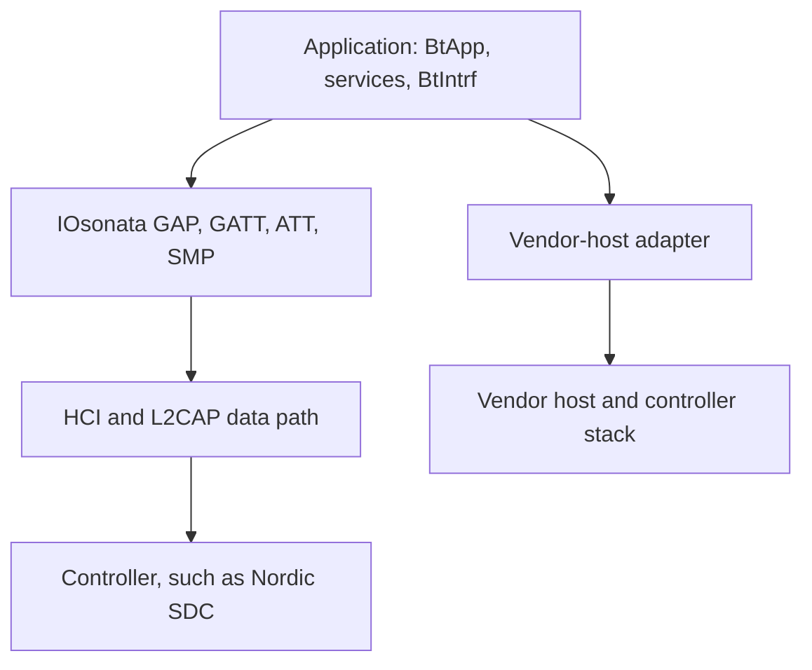

# Bluetooth Architecture

This document describes the current implementation boundaries. Use the
[Bluetooth User Guide](../bluetooth-user-guide.md) for application setup,
examples and memory configuration.

## Application, host and controller

The application uses `BtApp`, GAP/GATT services and optionally `BtIntrf`.
The selected MCU/stack library determines which implementation supplies those
APIs. There are two host arrangements:

HCI is the host/controller boundary. The generic host does not implement the
radio Link Layer. A vendor-host configuration maps application operations to
the vendor stack instead of running the generic ATT/SMP engines for that link.
Shared application structures do not make the two arrangements identical.

The principal port entry points are:

| Source | Responsibility |
|---|---|
| [bt_app_sdc.cpp](../../ARM/Nordic/src/bt_app_sdc.cpp) | Nordic SDC with IOsonata's generic HCI host |
| [bt_app_nrf52.cpp](../../ARM/Nordic/nRF52/src/bt_app_nrf52.cpp) | nRF52 SoftDevice application integration |
| [bt_app_bm.cpp](../../ARM/Nordic/nRF54/src/bt_app_bm.cpp) | nRF54 bare-metal SDK / S145 integration |
| [bt_app_stm32wba.cpp](../../ARM/ST/STM32WBAxx/src/bt_app_stm32wba.cpp) | STM32WBA vendor-stack integration |
| [bt_app.cpp](../../src/bluetooth/bt_app.cpp) | Shared state queries, link helpers and discovery-cache support |

Port existence is not evidence of feature parity or completed hardware
validation. For behavior changes, inspect the generic caller, selected vendor
adapter and controller implementation together.

## Protocol ownership on the generic HCI path

| Layer | Main source | Owns |
|---|---|---|
| Application | `bt_app.cpp` and port | Lifecycle, application callbacks, selected configuration |
| GAP | `bt_gap_hci.cpp`, `bt_adv_hci.cpp`, `bt_scan_hci.cpp` | Connection procedures, advertising and scanning |
| GATT | `bt_gatt.cpp`, `bt_gatt_hci.cpp` | Services, characteristics, subscriptions and TX completion |
| ATT | `bt_att.cpp`, `bt_attreq.cpp`, `bt_attrsp.cpp` | Database, attribute access and client/server transactions |
| SMP | `bt_smp.cpp`, `bt_smp_bond.cpp` | Pairing state, keys and bond records |
| L2CAP | `bt_l2cap.cpp` | Channel signaling and host protocol routing |
| HCI | `bt_hci_host.cpp` | Commands/events, ACL credits, fragmentation and reassembly |
| Controller interface | `bt_hci_ctlr.cpp` and port | Controller startup and transport boundary |

These source names are under `src/bluetooth/`. Generic security obtains
cryptographic operations through the existing crypto-engine interfaces.
Vendor-host ports retain their vendor pairing and storage integration.

## Per-link state

`BtDevice_t` and the peer pool represent remote links. Connection handles
identify links; the application must not equate one active link with the
whole device's state.

Per-link data includes negotiated MTU, security state, CCCDs, outstanding
indication/client transactions and TX tracking. HCI completions replenish
controller credits and complete the associated transmitted groups; an
accepted send is not proof that a remote application consumed its value.

Discovery caches are separate from peer records. A peripheral-only program
does not need to retain discovered remote service databases. The cache
descriptor can be sized for the number of simultaneously discovered peers.

Use public queries and callbacks. `g_BtAppData` is shared implementation
state for the generic code and ports, not an application configuration API.

## BtIntrf and DeviceIntrf

`BtIntrf` is a `DeviceIntrf` specialization over a GATT service. Its C++
wrapper uses `BtDevIntrf_t` and the same C operations, so C and C++ callers
share one implementation.

The service's write callback produces RX FIFO packets. Application TX queues
packets and attempts notifications; the characteristic TX-complete callback
continues draining them. The implementation owns the service context and
those callbacks after initialization.

This is a software transport layered above GATT. It does not own a controller,
replace ATT flow control, or create a second protocol stack. Its current
notification destination is the first subscribed peer. Explicit multi-link
routing belongs in the per-connection GATT operations.

The normal `DeviceIntrf` wrappers retain transfer serialization. Callers
must not bypass them to obtain a second uncoordinated data path.

## Initialization and feature linking

A port's `BtAppInit()` retains the application configuration, initializes
its stack and invokes the application hooks. The current reviewed ports call
`BtAppInitUserServices()` before `BtAppInitUserData()`. Read the selected
implementation when adding hook dependencies.

On the SDC and updated nRF52 paths, adding a service or initiating a connection
references `BtAppConnInit()`. That activates connection state and resources.
A service-free connectable peripheral must explicitly request it.
Other vendor-host ports may initialize connection support eagerly.

Security is explicitly selected with `BtAppSecInit()` from the user-data
hook on the updated ports. Generic HCI security and vendor security remain
separate implementations behind that application entry point. Advertising
and scanning do not inherently require SMP or a bond store.

Controller scan, connection and periodic support also depend on the modules
referenced by the final program. Reserved counts and linked support must
agree; unsupported or missing resources should be diagnosed at startup,
rather than hidden by larger unconditional pools.

## Memory ownership

Protocol and driver paths use static or caller-owned storage. There is no
application heap requirement for these paths.

Keep controller memory, peer records, ATT database, discovery caches, long-write
assembly, application events and transport FIFOs as distinct budgets.
Increasing one does not increase another. A vendor host may own an additional
private stack memory region.

Public weak descriptors let an application replace selected default pools.
Header macros applied only to an application do not resize arrays already
compiled into the MCU library. Rebuild both sides after ABI/layout changes.

Bond persistence is separate from successful pairing. The generic bond layer
has serialization and save/load hooks; the optional PDS adapter defers writes
through `BtEvtQue()` and retries failures from the port timer. Continue
processing deferred work before expecting a saved bond to survive reset.
Vendor-host persistence follows the selected port's backend.

## Events and scheduling

Interrupt-facing code does what needs immediate service in the interrupt
and hands everything else to `BtEvtQue()`, the one way the Bluetooth
subsystem signals work: security requests, the stack pump
of STM32WBA, timeout checks. Each kind of work is queued at most once. The
library default of `BtEvtQue()` puts the work in the application event
queue, which the application runs, first in first out, with `AppRun()` or
its own loop. No subsystem runs that queue itself, so USB and Bluetooth share
it in one loop.

When the event queue is empty, `AppRun()` calls `AppCheckStatus()`. Its weak default
checks the linked USB and Bluetooth subsystems. `BtAppCheckStatus()` retries
retained LESC work and port work refused by a full queue. Recovery queues the
original callback; it does not execute security or stack work in the interrupt.
Periodic timeout checks continue to use their timers.

A custom bare-metal loop drains `AppEvtHandlerExec()` until it returns false,
then calls `AppCheckStatus()`, and waits only if it returns true (idle) and
`AppEvtHandlerPending()` is false.
This last check includes work queued by the status check. An application may
override `AppCheckStatus()` to check its own system status and return false
while its system has work to do, even if no event is queued.

A port whose timeouts need time to pass queues them from a 1 s timer: the
port timer on nRF52 SoftDevice and SDC, the STM32 timer server on STM32WBA.
The nRF54 SoftDevice reports the GATT timeouts itself and needs none.

An RTOS application overrides `BtEvtQue()` to send each piece of work as a
message to its Bluetooth task, which runs it and calls `BtAppCheckStatus()`
before blocking for more work. The USB task similarly calls `UsbCheckStatus()`;
each check runs in the worker owning its subsystem. Do not move substantial
storage or protocol work into interrupt context to avoid the queue.

## Periodic advertising

Periodic advertising and synchronization extend the generic HCI path.
Their controller resources are explicit in `BtAppCfg_t`; unused counts
remain zero. PAwR additionally needs response support and resources in the
selected controller. The supplied examples select SDC and retain the
extended-advertising setup needed for the periodic train.

## HCI over USB

`BtHciUsb` belongs at the device-side USB transport boundary for controller
applications. It derives from `UsbDeviceClass` and `UsbIntrf`, with a
`UsbIsoIntrf` member for SCO. USB descriptors, configuration and endpoints
remain governed by the [USB architecture](usb.md).

Exposing a controller over USB does not also instantiate an application GATT
server or the generic SMP host. Keep USB transport validation distinct from
Bluetooth host and over-the-air validation.

## Validation boundaries

[Host tests](../../tests/bluetooth/host/README.md) exercise production generic
code and selected port code with controller/vendor stubs.
[Compliance tests](../../tests/bluetooth/compliance/README.md) add deterministic
HCI and dual-host ATT/SMP scenarios.

Neither suite proves RF interoperability or Bluetooth qualification. Hardware
reports must identify the MCU, board, stack configuration, controller version,
peer and tested procedures. HCI USB testing is evidence for that transport,
not for every Bluetooth feature or MCU port.
