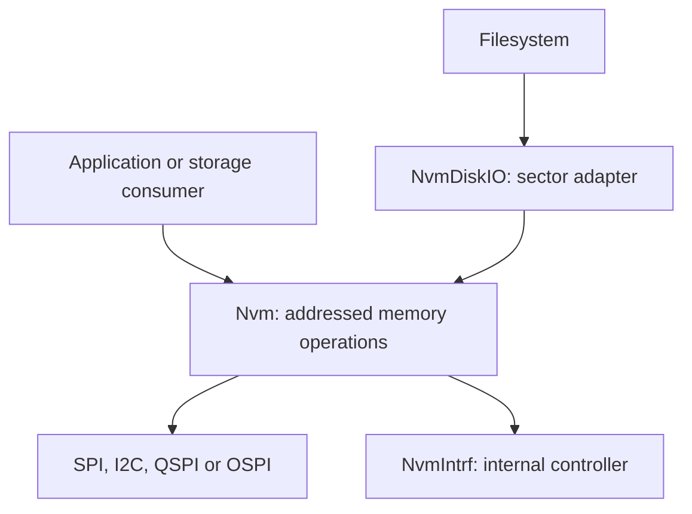

# NVM Architecture

Use the [NVM User Guide](../nvm-user-guide.md) for setup, examples and testing.
This document describes the existing implementation and its ownership rules.

## One device behavior, injected transport

`Nvm` derives virtually from `Device` and accepts a `DeviceIntrf *`.
Its configuration describes capacity, erase/program geometry, commands,
protection and operation mode. Memory technology alone does not require
another behavioral subclass.

`NvmDiskIO` is an adapter to a different behavior, sector access. It owns a
reference to an NVM device; it is not a new memory technology. This follows
[device composition](device-composition.md).

## Responsibility boundaries

| Component | Owns |
|---|---|
| Application / linker | Region allocation, objects, buffers, interface setup and callback wiring |
| `Nvm` | Region-relative addressing, range/alignment checks, page splitting, medium readiness and operation result |
| `DeviceIntrf` | Transfer serialization, command/data movement and transport completion |
| `NvmIntrf` port | Internal controller access, staged transfer data and supported arbitration routes |
| Stack arbiter | When an internal-memory operation may run alongside radio activity |
| `NvmDiskIO` | Sector geometry, erase-before-sector-write and synchronization before buffer reuse |
| Filesystem / record store | Files or records, caching policy, recovery, and which writes survive a reset |

`NvmCfg_t::bIntEn` belongs to the NVM operation. The injected interface's
interrupt/DMA settings belong to its creator. `Nvm::Init()` reads that
interface configuration but does not replace its event callback or mode.

## Address and region model

A device address is formed from mapped base, region offset and operation
offset. The application API bounds operations to the configured region.
A serial chip normally has base zero; internal memory may have a nonzero
mapped base, such as STM32 flash.

Linker regions are represented by `__start_nvm0` / `__stop_nvm0` and the
corresponding region-1 symbols. `nvm_region.cpp` derives the size from those
bounds. Missing symbols yield no usable region; it does not guess free space.

The linker must exclude the region from executable allocation.
`NvmMcuCeiling()` is a target/stack upper boundary, not an allocator or proof
that a range is free. Partition ownership remains above the device.

Although public offsets are 64 bits, the current generic command frame uses
32-bit addresses and rejects a configured range beyond that address space.

## Transport completion versus medium completion

A write can contain several page-sized transfers. Each transfer can finish
before the memory's program operation does. The implementation therefore
tracks an NVM operation separately from one outstanding interface transfer.

The operation progresses through issuing, in-flight and settling states.
The interface callback records transfer completion/failure through
`Nvm::IntrfEvent()`; foreground service advances the medium operation and
issues remaining chunks. Successful completion and failure are retained until
reported through the result path.

`IsBusy()` calls the service step; it is not a passive flag read.
`Sync()` drains work and reports a retained error. A following read, write or
erase also drains previous work before beginning its own operation.
Completion callbacks are delivered after releasing the operation lock.

TX-ready and FIFO-empty are not transfer completion. Only the appropriate
completed/timeout events change the outstanding transfer state. The
implementation arms that state before submitting, since a completion may
arrive inside the submission call.

Transport serialization still uses the normal `DeviceIntrf` start/stop
ownership. The NVM operation lock coordinates its higher-level state; it
does not replace the shared interface lock or authorize bypassing it.

## Buffer and execution lifetime

Deferred writes retain the caller's data pointer across chunks. The caller
must preserve the entire buffer until operation completion. A controller's
small staging buffer does not imply the whole write was copied.

A deferred step may still perform a synchronous bus transfer or settling
delay. Operation mode, DMA mode and scheduler behavior are independent.
Polling budgets count iterations, so applications needing time-based limits
must account for their wait callback and target timing.

An arbiter operation and its context must survive until the completion
callback. Radio-timeslot callbacks can run in a high-priority interrupt;
their work must remain short and bounded. Defer higher-level storage work to
the existing foreground processing.

## Internal controller ports

The generic driver and the controller interface are distinct objects.
`NvmIntrf` wraps the single port-owned controller interface returned by
`NvmMcuDevIntrf()`. Multiple wrappers do not provide independent instances
of controller state or callback ownership.

[Nordic nvm_nrfx.cpp](../../ARM/Nordic/src/nvm_nrfx.cpp) contains NVMC and
RRAM paths and integrates direct, SoftDevice and MPSL-timeslot operation as
supported by the selected build. Geometry comes from the target; RRAM's
no-erase behavior must not be replaced with a flash assumption.

[STM32 nvm_stm32.cpp](../../ARM/ST/src/nvm_stm32.cpp) supports the selected
WBA/L4 families. Its transfers complete in the call. It retains an arbiter
registration hook, but the current operation path does not consume that hook.
It is therefore not an architectural reference for deferred radio arbitration.

A generic declaration is not evidence that every target implements it.
Review the actual port and stack integration before enabling a new operating
mode. No new hardware qualification is implied by these source descriptions.

## Block adapter semantics

`NvmDiskIO` requires sectors that divide the region and contain whole erase
units where applicable. It cannot safely implement a smaller logical sector
by erasing adjacent sectors behind the caller's back.

A sector write erases when necessary, writes, then synchronizes before
returning. This is essential because a filesystem may immediately reuse its
source buffer. Buffered DiskIO operations have a separate cache layer above
that path.

The adapter does not supply wear leveling, an atomic multi-sector transaction
or power-loss recovery. Those guarantees belong to the selected filesystem
or record store. Its void erase interface also limits error propagation;
integration code must not infer a durability guarantee from that API shape.

Existing `Flash` / `FlashDiskIO` applications remain separate compatibility
paths. This architecture describes the current `Nvm` path, not an automatic
migration of those applications.

## Verification

The generic host test exercises mock NOR, EEPROM, FRAM, phased QSPI and
event-driven interfaces. Block and littlefs model tests exercise consumers
above NVM. They cannot establish controller arbitration, physical programming
behavior, endurance or power-loss recovery.

Hardware validation must identify the selected region and port, check
neighboring storage, and record completion and arbitration results with any
radio stack running. Firmware, filesystem, DFU and bond regions must have
explicit, non-overlapping ownership.
