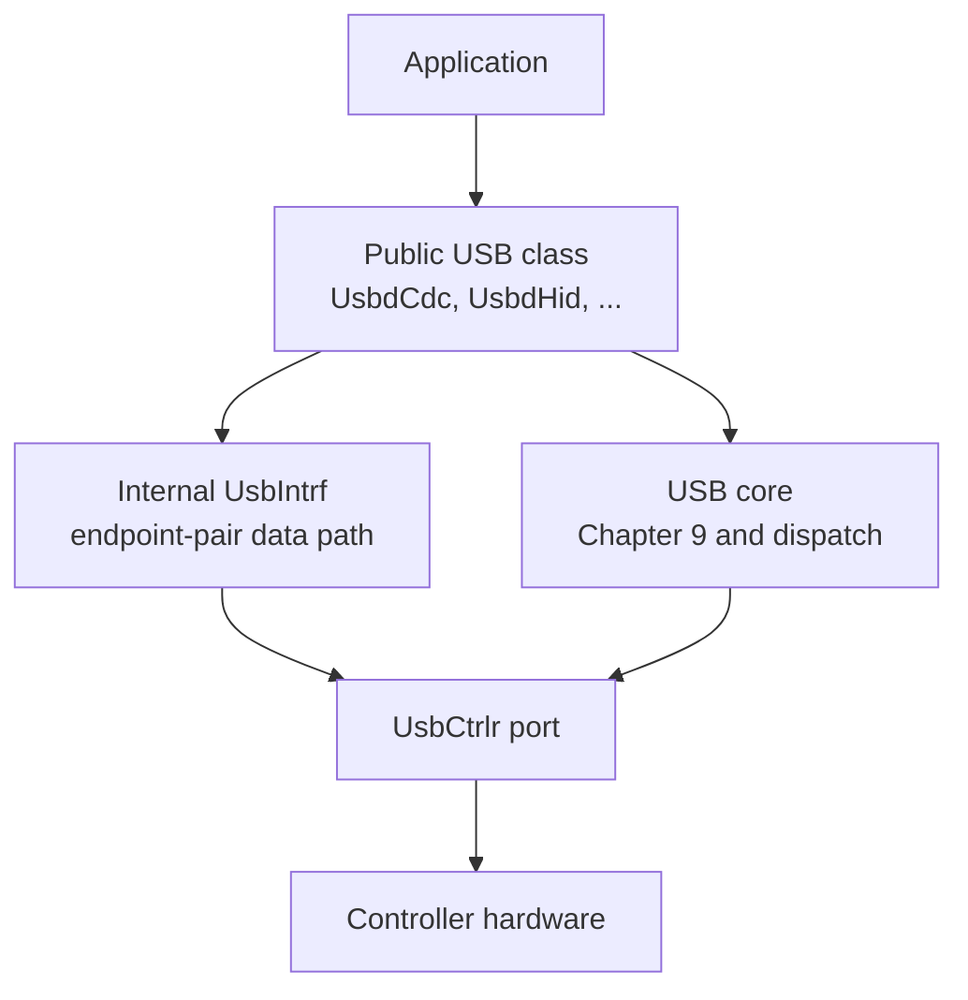
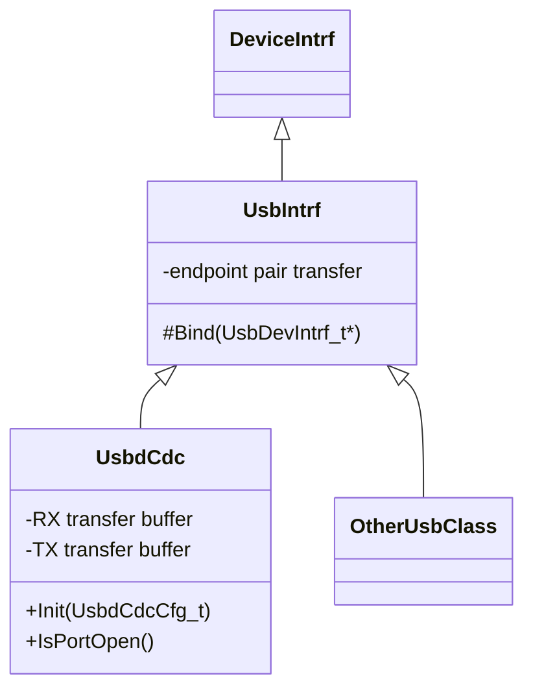
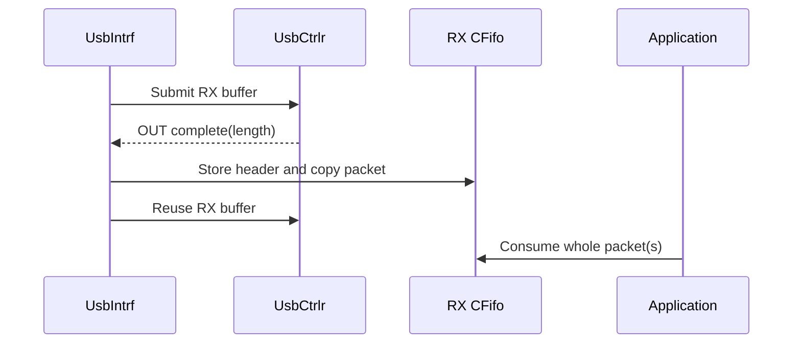

# USB Architecture

The USB device stack separates portable USB behavior from controller hardware
and exposes class data through the same `DeviceIntrf` API used by the rest of
IOsonata.



## Files and responsibilities

| File | Responsibility |
| --- | --- |
| `include/usb/usb_def.h` | USB specification definitions, descriptors and requests |
| `include/usb/usb.h` | Portable USB core and the controller-port contract |
| `src/usb/usb.cpp` | Endpoint zero, Chapter 9, lifecycle and function dispatch |
| `include/usb/usb_intrf.h` | Internal `DeviceIntrf` endpoint-pair data path |
| `src/usb/usb_intrf.cpp` | RX/TX FIFO and controller transfer handling |
| `include/usb/usbd_cdc.h` | Public CDC ACM class and application configuration |
| `src/usb/usbd_cdc.cpp` | CDC requests, notifications and data-endpoint ownership |
| `<port>/include/usb_ctrlr.h` | Target controller capabilities |
| `<port>/src/usb_ctrlr_<family>.cpp` | Registers, DMA and interrupts |

The `usbd_` prefix identifies device classes. The `usb_` prefix is role
neutral. `UsbCtrlr` is also role neutral because the port boundary describes
controller operations rather than class policy.

## Class model

`UsbIntrf` is not a public application object. It is the reusable endpoint data
path inherited by each public USB class.



The C representation follows the same IOsonata pattern: the base
`UsbDevIntrf_t` is the first member of the class-specific device structure.
The C++ public class binds its inherited `UsbIntrf` wrapper to that base.

## Endpoint model

An endpoint address is a direction bit plus an endpoint number. IN endpoint 1
and OUT endpoint 1 are distinct USB endpoints and can transfer concurrently.
They may legally share the number even though each individual endpoint is
unidirectional.

One `UsbIntrf` instance therefore stores one endpoint number, `EpNo`, and
represents the class data pair:

| Operation | Derived address |
| --- | --- |
| Receive | `USB_ENDPADDR_DIROUT(EpNo)` |
| Transmit | `USB_ENDPADDR_DIRIN(EpNo)` |

It never stores duplicate RX and TX endpoint addresses. The class owns any
additional one-way endpoint itself; for example CDC owns its interrupt IN
notification endpoint separately from its bulk data pair.

`DeviceIntrf.DevAddr` is not used for endpoint selection. `DevNo` selects the
USB controller, never the device address assigned by `SET_ADDRESS`.

## Storage ownership

There is no heap allocation in the data path.

| Storage | Supplied by | Lifetime and use |
| --- | --- | --- |
| RX CFifo memory | Application in public class config | Queued packets awaiting the application |
| TX CFifo memory | Application in public class config | Bytes or packets awaiting transmission |
| RX controller buffer | Derived USB class | One active OUT transfer, reused after every completion |
| TX controller buffer | Derived USB class | One active IN transfer, reused after every completion |

The derived class sizes controller buffers for its transfer type. CDC bulk
uses `USB_PKT_MAXLEN(0, BULK)`; a HID class can use its interrupt packet size
instead. The RX CFifo is built once at that same static maximum. The negotiated
MPS is applied only after the device speed is known and the class opens both
endpoint directions.

Applications size RX packet storage statically using the controller's compile
time maximum:

```c
#define CDC_RXFIFO_MEMSIZE \
    USB_INTRF_RXMEM_SIZE(4, USB_PKT_MAXLEN(0, BULK))
```

Each RX CFifo block is a word-aligned `UsbPktHdr_t` followed by space for one
packet. `UsbPktHdr_t.Length` preserves short, full and zero-length packets.

## Receive path

RX uses one stable controller buffer and one copy on completion:



Initialization creates the packet CFifo using the class buffer capacity.
`UsbIntrfConfigure()` records the negotiated MPS, flushes the queues and
submits the class-owned RX buffer. Every successful OUT completion:

1. reserves one CFifo block;
2. stores the received length and copies the controller buffer into it;
3. notifies the application after the copy is complete;
4. resubmits the same controller buffer when another block is available.

There is no RX lock and no RX active flag. The USB interrupt is the sole RX
producer and foreground code is the sole consumer on the supported single-core
targets. The interrupt finishes the copy before foreground execution resumes.
The controller already owns the hardware busy state, so duplicating it in
`UsbIntrf` would only create another state to synchronize.

`DeviceIntrfRxData()` consumes only complete packet blocks. It may combine
several complete packets in the caller's buffer, but it never splits the head
packet. If the head packet does not fit, it returns zero and leaves that packet
queued. A zero-length packet is released without consuming caller space.

When the RX CFifo is full, OUT is left unarmed. USB then backpressures the host
instead of dropping a packet. Completion reuses the RX buffer immediately,
before application event callbacks. A read attempts to re-arm OUT only when it
releases a previously full FIFO.

CDC DTR is class state only. It drives `IsPortOpen()` and the state-change
notification; it does not enable or disable the generic receive path.

## Transmit path

TX always copies queued data into the class-owned TX controller buffer before
submission, because the controller retains that buffer until completion.

TX CFifo mode is selected only by block size:

- Block size 1 is byte-stream mode. `UsbIntrf` packetizes queued bytes up to
  MPS. CDC uses this mode.
- Block size `sizeof(UsbPktHdr_t) + MPS` is packet mode. Each block describes
  exactly one packet and packet blocks are never combined.

An idle producer starts transmission immediately. While IN is busy, producers
only append to the FIFO. Completion copies and submits the next queued data
while it still owns the inherited `DeviceIntrf.bTxReady` token.

In byte-stream mode each submission calls `CFifoGetMultiple()` once with MPS as
the requested count. The returned contiguous byte count is copied to the TX
controller buffer and submitted immediately. Completion repeats the same
operation. A partial packet is not delayed, and there is no SOF tail scheduler
or separate ZLP state.

Byte mode and packet mode are separate `DevIntrf.TxData` handlers, chosen once
in `UsbIntrfInit()` from the CFifo block size. Byte mode is the CDC hot path and
runs once per `DeviceIntrfTx()` call, so a one byte write walks all of it; a
mode test at the top would be paid on every byte. Split this way the byte path
compiles to the same instruction sequence it had before packet mode existed.

## Minimal state and lifecycle

`UsbIntrf` deliberately does not mirror state already owned elsewhere:

| Question | Single source of truth |
| --- | --- |
| Is the `DeviceIntrf` enabled? | inherited atomic `EnCnt` |
| Is an endpoint transfer active? | `UsbCtrlrEpBusy()` / controller |
| Which endpoint directions belong to this data path? | one `EpNo` |
| Is the pair configured? | `Mps != 0` |
| Is TX software-owned? | inherited `bTxReady` token |
| Is TX byte or packet mode? | `hTxFifo->BlkSize` |

There is no `bEnabled`, `RxActive`, `RxAccepting`, separate RX/TX endpoint
address, release flag, TX queue watermark, tail flag or ZLP flag.

The lifecycle is:

1. `UsbInit()` initializes portable core and controller software state.
2. A public class such as `UsbdCdcInit()` registers its USB function and calls
   `UsbIntrfInit()` with application FIFOs, endpoint number and class buffers.
3. `UsbEnable()` powers the controller, endpoint zero and bus pull-up.
4. Configuration opens the class endpoints and calls
   `UsbIntrfConfigure(Mps)`, which starts RX.
5. Reset or unconfiguration closes endpoints and calls
   `UsbIntrfUnconfigure()`, which clears MPS and flushes both FIFOs.

`Enable()` also attempts RX/TX submission. This makes the inherited
`DeviceIntrf` enable transition sufficient; it does not introduce a separate
`RxKick` state machine.

## Port boundary and capabilities

`usb.h` declares the portable `UsbCtrlr` entry points. Each target supplies a
plain `usb_ctrlr.h` on its include path plus the implementation for its MCU.
Generic code never switches on a vendor macro.

The target header publishes compile-time capabilities used for static memory
sizing:

```c
USB_CTRLR_CNT
USB_PKT_MAXLEN(DevNo, TransType)
USB_EPIN_CNT(DevNo)
USB_EPOUT_CNT(DevNo)
USB_HIGHSPEED_CAPABLE(DevNo)
USB_ISO_SUPPORTED(DevNo)
```

`UsbCtrlrEpXfer()` retains the submitted buffer until it reports completion.
The port owns registers, DMA/FIFO access, endpoint busy state and controller
interrupts. The generic layer owns no MCU-specific facts.

The nRF52 USBD peripheral has one EasyDMA engine shared by every endpoint.
Endpoint work is therefore recorded in pending masks and started only from
`USBD_IRQHandler()`. The handler waits for the corresponding ENDEP event before
another endpoint may program EasyDMA. Starting pending DMA directly from an
application call or from a nested transfer-completion callback breaks this
single-owner rule and can leave an IN or OUT request with no completion event.

## Function registration

Each class or vendor function registers one `UsbFuncCfg_t` containing its
interface range, endpoint masks and callbacks. Endpoint zero belongs to the
generic core; bit zero must be clear in function endpoint masks, and masks may
not overlap between functions.

## Known gaps

- Isochronous endpoints are not yet driven by a port.
  `USB_ISO_SUPPORTED` reports this independently of hardware packet capacity.
- There is no host-controller layer yet. Role-neutral naming preserves that
  extension point.
- Current ports hold one file-scope controller state because all supported
  parts report `USB_CTRLR_CNT == 1`; the public signatures already carry
  `DevNo` for a future multi-controller port.
