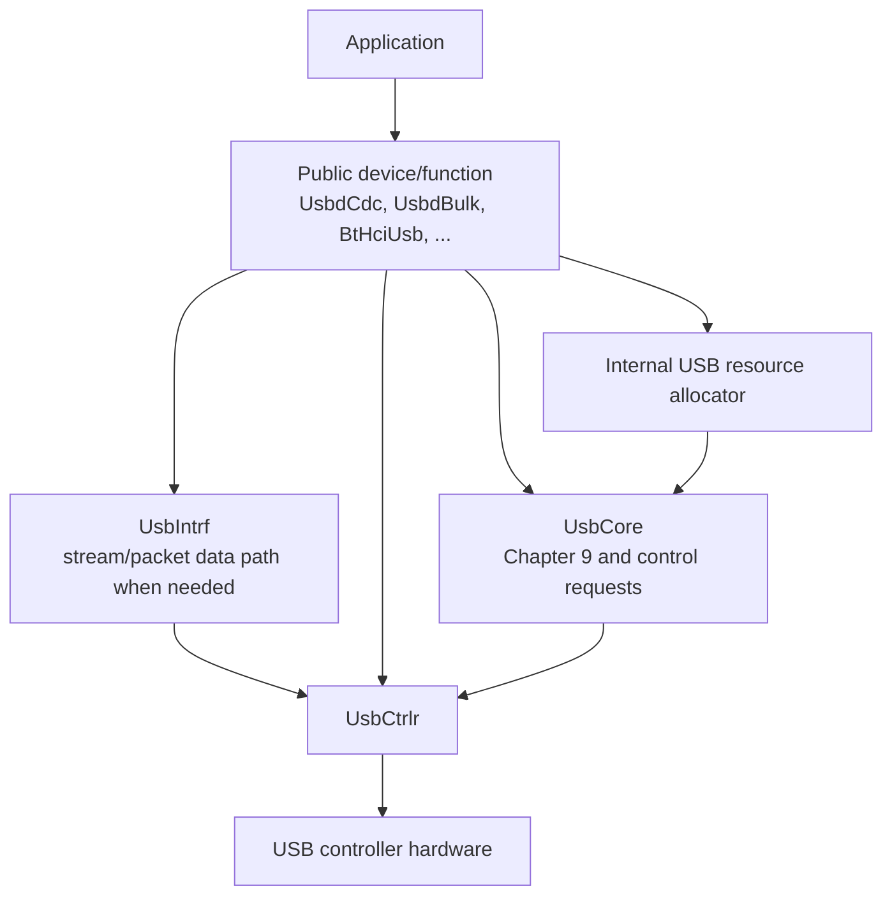

# USB Architecture

IOsonata keeps the application-facing USB API simple. Applications instantiate
the USB device/function they need, initialize it, and use its normal interface.
Applications do not assign USB interface numbers or endpoint numbers.

The USB implementation allocates those resources internally and connects each
function to the generic USB controller layer.



For an application developer the intended model is therefore:

```text
instantiate device/function
        |
        v
      Init()
        |
        v
    UsbEnable()
        |
        v
use the class or DeviceIntrf API
```

Endpoint placement, interface numbering, endpoint callbacks, descriptors and
controller transactions remain implementation details.

## Architectural rules

These rules define the USB layering and must remain true when new classes or
transfer types are added.

1. Applications never choose interface or endpoint numbers.
2. USB classes declare resource requirements; the internal allocator assigns
   legal interface and endpoint numbers.
3. The controller does not know CDC, HCI, HID, Bluetooth packet formats, FIFO
   formats or other class policy.
4. Endpoint transfer type is established when an endpoint is opened. A normal
   endpoint transaction uses the same controller transfer primitive regardless
   of whether the endpoint is Bulk, Interrupt or Isochronous.
5. Non-control endpoint events go directly from the controller to the callback
   registered for that endpoint. They are never routed through the USB function
   table or through another class.
6. `UsbIntrf` is a reusable stream/packet data path. It is not the universal
   owner of every USB endpoint type.
7. Interrupt endpoints are owned directly by the function that defines the
   notification/event protocol.
8. The reusable isochronous layer must receive controller endpoint events
   directly. Bluetooth SCO policy belongs above that layer.
9. Endpoint ownership masks in `UsbCore` exist for composition and Chapter 9
   endpoint-recipient requests. They are not a data-completion dispatch table.
10. The data path uses static storage. No USB transfer path requires dynamic
    allocation.

The important internal boundary is:

```text
                    UsbCtrlr
                       |
            +----------+----------+
            |                     |
      controller/core          endpoint
          events                events
            |                     |
          UsbCore          registered owner
                                  |
                    +-------------+-------------+
                    |             |             |
                 UsbIntrf      class-owned   UsbIsoIntrf
                 Bulk/data     Interrupt      Isochronous
```

## Public classes and automatic resource allocation

A public USB class describes what it needs, not where it should be placed.
`UsbRegisterFuncAuto()` finds the lowest legal placement accepted by the USB
core and controller capabilities.

Examples:

- CDC ACM requests two interfaces, one Interrupt IN endpoint and one
  bidirectional Bulk endpoint number.
- A vendor Bulk function requests one interface and one bidirectional Bulk
  endpoint number.
- Bluetooth HCI requests its HCI/synchronous interfaces, an Interrupt IN Event
  endpoint, a bidirectional Bulk ACL endpoint number, and, when SCO is enabled,
  a controller-supported bidirectional Isochronous endpoint number.

The resulting numbers are stored only in private class state and used to build
that class's descriptors and open its endpoints. They are never added to the
application configuration merely to expose USB placement.

Fixed endpoint constraints are also internal. For example, a controller with a
dedicated ISO endpoint advertises that through controller capability masks and
the allocator satisfies the constraint without involving the application.

## Controller boundary

Every target provides `usb_ctrlr.h` and a matching controller implementation.
Portable USB code never switches on a vendor macro.

The controller interface has four main concepts:

```text
Init
Endpoint Open/Close
Endpoint Xfer
Event Callback
```

Support operations such as stall/clear-stall, remote wakeup, connect/disconnect
and controller start/stop surround those four concepts but do not change the
data-path model.

### Initialization and controller-wide events

`UsbInit()` installs the controller/core callback through `UsbCtrlrInit()`.
Controller-wide USB events such as Reset, Suspend, Resume and SOF are delivered
there because they affect the whole device rather than one non-control endpoint.

EP0 is owned by `UsbCore`. A SETUP packet originates on EP0 and EP0 transfer
completion belongs to the control-transfer state machine. The current port API
delivers those EP0-specific events to `UsbCore` through the callback installed
at controller initialization. This is an EP0 implementation detail; it must not
become a route for non-control endpoint completions.

Conceptually:

```text
USB bus / protocol engine
        |
        +-- Reset/Suspend/Resume/SOF --> UsbCore callback
        |
        +-- EP0 SETUP / EP0 complete --> UsbCore control state machine
```

### Endpoint configuration

`UsbCtrlrEpOpen()` receives an endpoint descriptor. The descriptor establishes:

```text
endpoint address and direction
transfer type: Control / Bulk / Interrupt / Isochronous
maximum packet size
service/polling interval where applicable
```

The transfer type belongs here. It must not create separate controller APIs such
as `BulkXfer()`, `InterruptXfer()` or `IsoXfer()`.

### Endpoint registration and transfer

Non-control endpoints register their static controller buffer, endpoint event
callback and context once. `UsbCtrlrEpXfer()` then submits a transaction using
that endpoint's registered buffer.

```text
endpoint owner
    |
    +-- register buffer + callback
    +-- open endpoint descriptor
    +-- UsbCtrlrEpXfer(endpoint, length)
    |
    <-- endpoint callback(event, length, result)
```

The fixed-buffer registration is an IOsonata implementation choice that keeps
DMA staging static. It does not change the USB abstraction: the controller
still sees an endpoint transfer, not a CDC transfer, HCI transfer or ISO frame.

EP0 currently has `UsbCtrlrEp0Xfer()` because the control state machine chooses
a different data pointer for each request. Semantically it is still an endpoint
transaction. The special entry point exists for EP0's dynamic control-stage
buffer, not because Control is routed through a class-specific transfer API.

## Endpoint events

Non-control endpoint events are direct:

```text
controller interrupt
        |
        v
registered endpoint callback
        |
        v
endpoint owner
```

There is no path of the form:

```text
controller -> UsbCore -> UsbFuncCfg -> class -> endpoint owner
```

for data completion.

This direct rule applies equally to Bulk, Interrupt and Isochronous endpoints.
Only the owner and the semantics above the callback differ.

`UsbCtrlrEvtType_t` is currently shared by the controller/core callback and
endpoint callbacks. That type sharing must not be interpreted as shared event
routing. Nonzero endpoint transfer events are delivered only to their registered
endpoint callback.

## Control transfers

`UsbCore` owns endpoint zero and the USB control-transfer state machine:

```text
SETUP
  |
  +-- DATA stage when present
  |
  +-- STATUS stage
```

`UsbCore` handles standard Chapter 9 requests and dispatches class/vendor
requests to the registered function that owns the addressed interface or
endpoint. The function table is therefore a control-request ownership table,
not a data endpoint event router.

Control data moves through the controller EP0 transfer primitive. Classes never
own EP0 directly.

## Bulk/data path: UsbIntrf

`UsbIntrf` is the reusable `DeviceIntrf` implementation for class data that
needs FIFO-backed stream or packet behavior.

```text
Application / class
        |
     DeviceIntrf
        |
     UsbIntrf
        |
  UsbCtrlrEpXfer
        |
    controller
```

One `UsbIntrf` instance represents one internally assigned bidirectional
endpoint number:

```text
OUT = receive
IN  = transmit
```

The derived class supplies static RX/TX controller buffers and application FIFO
storage. `UsbIntrf` owns packet/stream queuing and copies between FIFO storage
and controller staging buffers. The controller owns hardware busy state, DMA
arbitration and transfer completion.

`UsbIntrf` is appropriate for CDC Bulk data, vendor Bulk data and HCI ACL data.
It is not a reason to force unrelated Interrupt or Isochronous semantics through
the same FIFO/event layer.

### RX

The controller reports endpoint receive readiness/completion to the registered
`UsbIntrf` callback. `UsbIntrf` decides whether storage is available, submits the
OUT transfer, copies the completed packet into its RX CFifo and notifies the
`DeviceIntrf` consumer.

Blocking/backpressure versus overwrite/drop behavior is `UsbIntrf` policy, not
USB class policy.

### TX

Foreground code queues bytes or packet blocks in the TX CFifo. When TX becomes
software-owned, `UsbIntrf` stages up to the active MPS in its fixed TX controller
buffer and calls `UsbCtrlrEpXfer()`. Completion stages the next queued transfer
until the FIFO is empty.

TX byte mode and packet mode are selected by CFifo block size; USB transfer type
and FIFO mode remain independent concepts.

## Interrupt endpoints

Interrupt endpoints are event-oriented and normally need no `UsbIntrf` wrapper.
The class that defines the event owns the endpoint directly.

CDC ACM notification is the model:

```text
CDC serial state changes
        |
        v
build SERIAL_STATE notification
        |
        v
UsbCtrlrEpXfer(Interrupt IN)
        |
        v
CDC notification endpoint callback
```

Bluetooth HCI Event uses the same controller pattern with Bluetooth event
packet semantics above it.

`bInterval` describes host scheduling. It does not require a firmware timer that
periodically pushes data. Firmware queues an event when it has one; the USB
controller/host schedule determines when the Interrupt transaction occurs.

## Isochronous endpoints

Isochronous is a distinct USB transfer type, not a form of Interrupt transfer.
It uses the same controller endpoint transfer primitive but has different
higher-level semantics: periodic service, no retransmission, and meaningful
missed/empty service intervals.

The target reusable architecture is:

```text
USB controller
    |
    v
UsbIsoIntrf
    |
    v
BtHciUsb SCO
```

`UsbIsoIntrf` owns generic USB isochronous behavior:

- bidirectional Isochronous endpoint lifecycle;
- static DMA staging;
- one transfer opportunity per USB service interval;
- IN/OUT start and completion;
- reset, suspend and resume handling;
- missed and empty service-interval handling;
- no dynamic allocation;
- no Bluetooth packet knowledge.

`BtHciUsb` owns Bluetooth behavior:

- synchronous-interface alternate settings;
- SCO header parsing and complete-packet assembly;
- segmentation of complete SCO packets into USB ISO frames;
- HCI packet-type routing.

The following layering is specifically forbidden:

```text
controller -> UsbCore -> BtHciUsb -> UsbIsoIntrf
controller -> UsbIntrf -> DeviceIntrf event -> UsbIsoIntrf
```

The existing `usb_iso.*` implementation on this development branch predates
this architecture decision and currently builds `UsbIsoIntrf` on `UsbIntrf`.
It is transitional code and must not be extended as the reference architecture.
The reusable ISO implementation must be refactored to register directly with
the controller before ISO work is considered complete.

## Function registration

The USB function table exists for composition and control-request dispatch.
Each registered function records its private interface range and endpoint
ownership masks so `UsbCore` can:

- reject overlapping allocations;
- route interface-recipient control requests;
- route endpoint-recipient control requests;
- maintain Chapter 9 halt and alternate-setting state.

It does not route non-control endpoint transfer events.

## Storage ownership

There is no heap allocation in the USB data path.

| Storage | Owner | Purpose |
| --- | --- | --- |
| Application RX/TX FIFO memory | Public class configuration | Queued application data |
| Bulk/data RX/TX staging | Derived class / `UsbIntrf` | Fixed controller DMA buffers |
| Interrupt staging | Endpoint-owning class | Small event/notification transfer |
| Future ISO staging | `UsbIsoIntrf` | Fixed per-service-interval transfer buffers |
| Hardware/DMA descriptors | Controller port | Controller transaction state |

Controller buffers and FIFO storage are separate. Removing that distinction
would allow foreground FIFO reuse while DMA still owns the transfer buffer.

## Lifecycle

At the application level:

```text
UsbInit
  |
class Init calls
  |
UsbEnable
  |
host enumerates and selects configuration
  |
classes open their internally allocated endpoints
```

Internally:

1. `UsbInit()` initializes portable state and calls `UsbCtrlrInit()`, installing
   the controller/core event callback.
2. Each class requests interfaces/endpoints from the internal allocator.
3. Each endpoint owner registers its static controller buffer and direct
   callback.
4. `UsbEnable()` starts the controller and connects the device.
5. Configuration/alternate-setting handlers open the descriptors for the
   already allocated endpoints.
6. Transfers use the controller endpoint transfer primitive.
7. Reset/unconfiguration closes active endpoints and clears class transfer
   state while static resource ownership remains known.

## Controller responsibilities

The controller port owns only hardware behavior:

- peripheral power/clock and interrupt control;
- endpoint register configuration;
- DMA/FIFO programming;
- active-transfer/busy state;
- controller-specific arbitration;
- conversion of hardware events into controller/core or endpoint callbacks.

The controller must not own class packet assembly, application FIFO semantics,
Bluetooth framing, CDC state or automatic class dispatch.

Controller capability macros publish static hardware limits such as:

```c
USB_CTRLR_CNT
USB_PKT_MAXLEN(DevNo, TransType)
USB_EPIN_CNT(DevNo)
USB_EPOUT_CNT(DevNo)
USB_HIGHSPEED_CAPABLE(DevNo)
USB_ISO_SUPPORTED(DevNo)
USB_ISO_EPIN_MASK(DevNo)
USB_ISO_EPOUT_MASK(DevNo)
```

These are consumed internally by class storage sizing and the resource
allocator. They do not expose endpoint placement to the application.

## Pre-ISO checklist

Before extending the current ISO implementation, verify these invariants:

- [x] Applications do not configure interface/endpoint numbers.
- [x] Function resources are assigned by the internal allocator.
- [x] Nonzero endpoint completions are delivered directly to registered
      endpoint callbacks.
- [x] `UsbCtrlrEpXfer()` is the common non-control endpoint transfer primitive.
- [x] Bulk/stream data uses `UsbIntrf` without class-level completion forwarding.
- [x] Interrupt endpoints such as CDC notification and HCI Event are owned
      directly by their classes.
- [ ] Remove controller knowledge of `UsbIntrf` blocking/nonblocking FIFO policy.
- [ ] Refactor `UsbIsoIntrf` so controller events terminate directly in
      `UsbIsoIntrf`, not in `UsbIntrf`.
- [ ] Re-run USB core, Bulk, CDC, HCI and hardware regression tests after that
      foundation is complete.

Do not add ISO behavior to `BtHciUsb` until the unchecked controller/ISO
layering items above are resolved.
